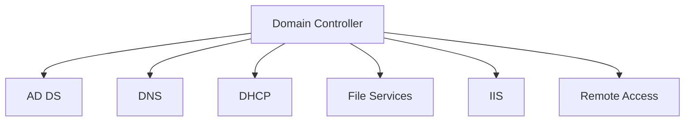
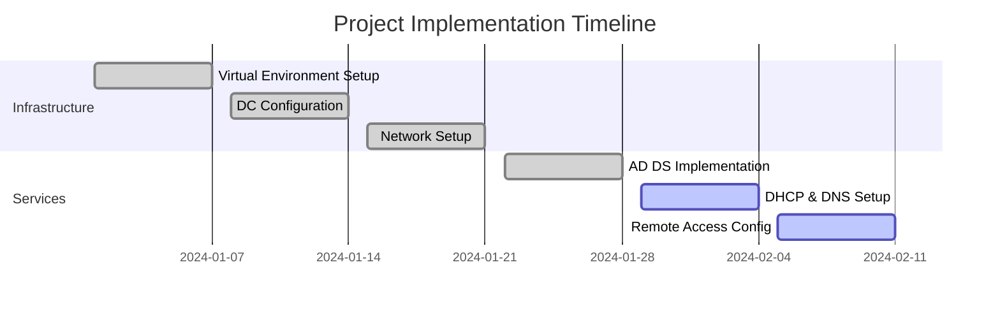

# Enterprise Active Directory Homelab 🖥️


## Table of Contents
- [Overview](#overview)
- [Technologies Used](#technologies-used)
- [Infrastructure Setup](#infrastructure-setup)
- [Network Configuration](#network-configuration)
- [Services Implementation](#services-implementation)
- [Skills Demonstrated](#skills-demonstrated)
- [Future Enhancements](#future-enhancements)

## Overview
<div align="center">
  
  <br/>
  <i>Server Manager Dashboard showing implemented roles and features</i>
</div>

This project demonstrates the implementation of an enterprise-grade Active Directory infrastructure using Oracle VirtualBox. The lab environment simulates real-world corporate network scenarios, providing hands-on experience with Windows Server administration and network services.

## Technologies Used
### Core Infrastructure
- 
- 
- 
- 

### Implemented Services


## Infrastructure Setup
### Virtual Environment Configuration
```powershell
# Virtual Machine Specifications
DC (Domain Controller):
  - OS: Windows Server 2019
  - RAM: 6GB
  - Network: 2 NICs
  
Client:
  - OS: Windows 10 21H2
  - RAM: 4GB
  - Network: Internal Network
```

## Network Configuration
<div align="center">
  
  <br/>
  <i>Network configuration showing IP addressing scheme</i>
</div>

### Network Architecture
```plaintext
Internal Network: 172.16.0.0/24
├── Domain Controller: 172.16.0.1
├── DHCP Range: 172.16.0.100-200
└── DNS: Internal DNS (127.0.0.1)
```

## Services Implementation
### Active Directory Configuration
- [x] Domain Controller Setup
- [x] Organizational Units Creation
- [x] User Account Management
- [x] Group Policy Implementation

### DHCP Setup
- [x] Scope Configuration
- [x] IP Range Definition
- [x] DHCP Options Setup
- [x] Lease Duration Settings

### DNS Configuration
- [x] Forward Lookup Zones
- [x] Reverse Lookup Zones
- [x] DNS Forwarders
- [x] Zone Transfers

## Skills Demonstrated
<table>
  <tr>
    <td><b>Infrastructure</b></td>
    <td><b>Networking</b></td>
    <td><b>Security</b></td>
  </tr>
  <tr>
    <td>
      • Windows Server Administration<br>
      • Virtualization Management<br>
      • Service Deployment
    </td>
    <td>
      • Network Configuration<br>
      • DHCP/DNS Setup<br>
      • IP Management
    </td>
    <td>
      • Active Directory Security<br>
      • Group Policy Management<br>
      • Access Control
    </td>
  </tr>
</table>

## Future Enhancements
- [ ] Secondary Domain Controller
  ```mermaid
  graph LR
      DC1[Primary DC] --> DC2[Secondary DC]
      DC2 --> DC1
  ```
- [ ] Additional Group Policies
- [ ] File Server Implementation
- [ ] Certificate Services
- [ ] Monitoring Solution

## Current Status and Progress


## Resource Monitoring
<div align="center">

| Service | Status | Last Check |
|---------|--------|------------|
| AD DS | ✅ Running | 2024-02-10 |
| DNS | ✅ Running | 2024-02-10 |
| DHCP | ✅ Running | 2024-02-10 |
| File Services | ✅ Running | 2024-02-10 |
| IIS | ✅ Running | 2024-02-10 |

</div>

## Documentation and References
- [Active Directory Best Practices](https://learn.microsoft.com/en-us/windows-server/identity/ad-ds/plan/security-best-practices/best-practices-for-securing-active-directory)
- [Windows Server Documentation](https://learn.microsoft.com/en-us/windows-server/)
- Project Repository: [GitHub](https://github.com/yourusername/ActiveDirectoryLab)

---
<div align="center">
  <i>This lab environment demonstrates practical experience with enterprise-level Active Directory infrastructure.</i>
  <br>
  <b>Last Updated: February 10, 2024</b>
</div>
